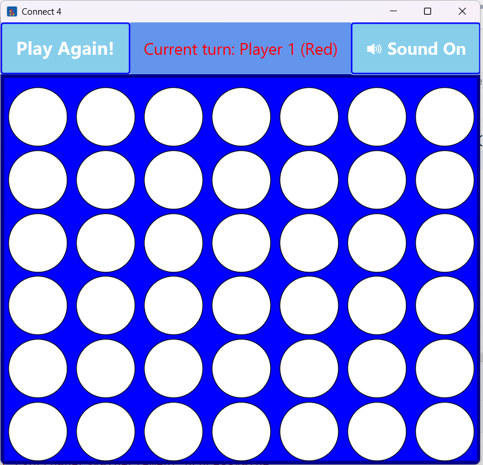

# Connect Four - JavaFX 🎮

Un semplice gioco di **Forza 4** sviluppato in **Java** con **JavaFX**.

---

## 🚀 Funzionalità
- Griglia dinamica con pedine animate 
- Effetti sonori durante la partita
- Evidenziazione della colonna al passaggio del mouse
- Popup con immagine per vittoria o pareggio
- Grafica adattiva: le pedine si ridimensionano automaticamente
- Possibilità di iniziare una nuova partita con reset della griglia

---

## 📖 Regole del gioco

I giocatori si alternano inserendo un gettone colorato in una colonna.
Vince il primo che connette 4 gettoni consecutivi:
-Orizzontale
-Verticale
-Diagonale
Se la griglia si riempie senza vincitori → la partita termina in pareggio.

---

## 📸 Screenshot

